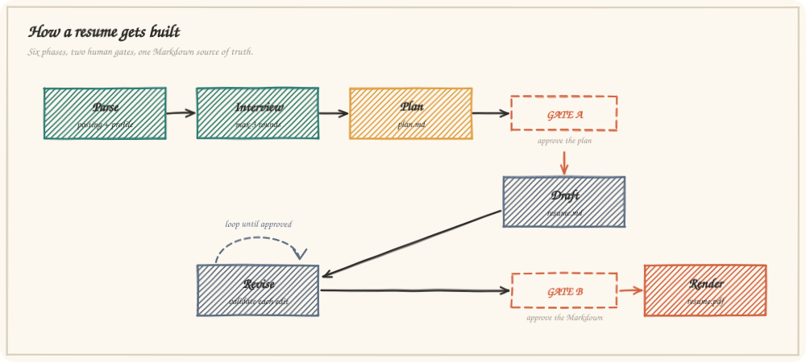

# Architecture

How the skill is put together, why each piece exists, and what happens on a run from first message to finished PDF.

- [The shape of the thing](#the-shape-of-the-thing)
- [Repository layout](#repository-layout)
- [Progressive disclosure](#progressive-disclosure)
- [The state machine](#the-state-machine)
- [Data flow](#data-flow)
- [The Markdown dialect](#the-markdown-dialect)
- [The scripts](#the-scripts)
- [The page-fit model](#the-page-fit-model)
- [The PDF pipeline](#the-pdf-pipeline)
- [The installer](#the-installer)
- [Design decisions](#design-decisions)

---

## The shape of the thing

A skill is instructions plus bundled files. This one splits into three kinds of content, and the split is the whole design:

| Kind | Example | Who consumes it |
|:--|:--|:--|
| **Procedure** | `SKILL.md` | The model, when the skill triggers |
| **Domain knowledge** | `references/*.md` | The model, when the phase that needs it begins |
| **Deterministic work** | `scripts/*.js` | The shell — output only ever reaches the model |

Anything a computer can decide exactly — does this file have a valid date range, will it fit on one page, how many pages did the PDF come out — belongs in a script. Anything requiring judgement — which achievement leads, whether a keyword is honestly earned — belongs in the model, guided by a reference file. Nothing is in both places.

<p align="center">
  
</p>

---

## Repository layout

```
skills/resume-architect/          the skill itself — this is what gets installed
├── SKILL.md                      procedure: triggers, phases, gates, non-negotiables
├── manifest.yaml                 packaging metadata
├── skill-card.json               machine-readable capability and safety card
├── references/
│   ├── ats-template.md           the universal template + Markdown contract
│   ├── intake-questions.md       question bank; what to extract from each source
│   ├── writing-rules.md          bullet formula, verbs, keywords, truthfulness gate
│   ├── workflow-contract.md      phase state machine, gates, folder layout, failures
│   └── pdf-pipeline.md           render stages, engines, exit codes, remedies
├── assets/
│   ├── resume-template.md        blank skeleton in the exact dialect
│   └── resume.css                print stylesheet: page box, margins, type scale
├── scripts/
│   ├── extract-linkedin.js       LinkedIn PDF -> clean text
│   ├── lint-resume.js            ATS + one-page validator
│   └── md-to-pdf.js              Markdown -> HTML -> PDF, with page count
└── evals/evals.json              8 eval cases, 37 assertions

bin/cli.js                        npx entry point
lib/install.js                    copy / remove / locate the skill
tools/measure-tokens.js           reproduces every token number in the docs
tools/make-diagrams.js            regenerates the charts from those measurements
test/e2e.test.js                  19 end-to-end checks
```

---

## Progressive disclosure

Three layers, loaded at three different moments:

1. **Always resident — 130 tokens.** The frontmatter `description`. This is the only part of the skill that occupies context in every session, and it exists to answer one question: is this request a resume request?
2. **On trigger — 2,505 tokens.** `SKILL.md`: the phase list, the gates, the non-negotiables, the command reference, and an index of what lives in which reference file.
3. **On demand — 879 to 1,142 tokens each.** A reference file opens when its phase begins. Drafting opens `writing-rules.md`; a two-page PDF opens `pdf-pipeline.md`. Most runs open one or two, never five.

Scripts are a fourth category: 9,218 tokens of source that never enters context at any point, because the model executes them and reads only their compact output.

The measured effect is in [TOKEN_ECONOMY.md](TOKEN_ECONOMY.md).

---

## The state machine

| # | Phase | Enters when | Leaves when |
|:--|:--|:--|:--|
| 0 | Intake setup | The request arrives | Posting text and profile source are both in hand |
| 1 | Source parsing | Phase 0 done | `keywords.txt` and `notes.md` written to disk |
| 2 | Interview | Phase 1 done | No blocking unknowns remain (max 3 rounds) |
| 3 | Plan | Phase 2 done | **Gate A** — the candidate approves `plan.md` |
| 4 | Draft | Gate A passed | `resume.md` written, validator reports zero errors |
| 5 | Revision | Draft delivered | **Gate B** — the candidate approves `resume.md` |
| 6 | Render | Gate B passed | PDF exists, page count confirmed, path reported |

Two properties make this hold up in practice:

**Gates are explicit and unidirectional.** Approval is a word the candidate says, never an inference from enthusiasm. Edits at a gate return to the phase that produced the artifact rather than advancing.

**Phase 4 has an internal loop the candidate never sees.** The draft is validated and fixed until the validator exits 0. A draft with structural errors is not presented as finished work.

---

## Data flow

```
job posting ──▶ keyword extraction ──▶ keywords.txt ──┐
                                                       ├──▶ plan.md ──▶ resume.md ──▶ resume.pdf
LinkedIn PDF ──▶ extract-linkedin.js ──▶ profile.txt ──┤          ▲          │
                                          │            │          │          ▼
                                          └──▶ notes.md┘          └── lint-resume.js
                                                   ▲                        │
                          interview answers ───────┘                 verdict (59 tokens)
```

`notes.md` is the fact base and the anchor for the truthfulness gate: every line in the resume traces to an entry in it, and every entry carries its source — profile export, supplied document, or interview answer. A claim with no traceable source is raised as a gap in the plan instead of written into the draft.

`keywords.txt` does double duty: it guides keyword placement during drafting, and it is passed to the validator as `--keywords-file` so coverage is measured rather than assumed.

---

## The Markdown dialect

The resume is a constrained subset of Markdown so that one converter and one validator can both read it exactly:

```markdown
# Jane Doe                                        <- exactly one H1: the name
Austin, TX · jane@example.com · (512) 555-0142    <- the contact line, plain text

## Professional Summary                           <- H2 from a fixed heading list

### Acme Analytics — Austin, TX                   <- H3: organisation — location
**Senior Data Engineer** | Mar 2022 – Present     <- bold title | date range
- Rebuilt the ingestion pipeline...               <- hyphen bullets, no nesting

**Languages:** Python, Go, SQL                    <- label rows, Skills only
```

The renderer maps these to a flat HTML structure — `h1`, `.contact`, `h2`, `.org`, `.role`, `ul > li`, `.skillrow` — with no tables, no floats, and no images. Left/right alignment inside `.org` and `.role` is flexbox on the rendered page only; the underlying text order stays company, title, dates, which is what parsers read.

The full contract, including the accepted heading list and section order, is in [`ats-template.md`](../skills/resume-architect/references/ats-template.md).

---

## The scripts

All three are CommonJS, zero-dependency, and make no network calls.

### `extract-linkedin.js`

```
node extract-linkedin.js <profile.pdf> [-o out.txt] [--json]
```

Tries `pdftotext -layout`, then `mutool draw`. Cleans the export: drops `Page N of M` furniture and the repeated profile URL line, collapses blank runs, normalises page breaks. Detects LinkedIn's section headings and reports them so the agent knows what it received. Exit code 4 when no extractor exists — the caller falls back to reading the PDF with its own file reader rather than failing the run.

### `lint-resume.js`

```
node lint-resume.js <resume.md> [--keywords "a,b"] [--keywords-file f] [--format Letter|A4] [--json]
```

Parses the dialect into a document model, then runs three families of check: **structure** (headings, contact, dates, entry shape), **ATS hygiene** (tables, images, emoji, decorative glyphs, pronouns, bullet markers), and **quality signals** (weak opening verbs, over-long bullets, bullet density per role, share of quantified bullets). Then it estimates page fill and, when keywords are supplied, scores coverage.

Errors block; warnings are judgement calls surfaced with their reasoning. Exit 1 when any error is present. `--json` returns the full report including `stats.estimated_page_fill_percent` and the keyword breakdown.

### `md-to-pdf.js`

```
node md-to-pdf.js <resume.md> [-o out.pdf] [--format Letter|A4] [--engine auto|chrome|wkhtmltopdf|weasyprint]
                  [--css file] [--timeout ms] [--html-only] [--json]
```

Renders the dialect to HTML, inlines `assets/resume.css`, prints it with the first available engine, then counts the pages in the PDF it produced and reports the count.

---

## The page-fit model

The validator predicts height before anything is rendered, so overflow is caught while it is still cheap to fix.

Usable height is 720pt on Letter and 769pt on A4 at 0.5in margins. Each element contributes its rendered height from the same constants the stylesheet uses — 22.9pt for the name, 19.8pt for the contact line, 27.2pt for a section heading, 18.0pt for an organisation row, 14.5pt for a role row, and 13.0pt per wrapped line of body or bullet text. Wrapping is estimated at 104 characters per bullet line and 107 per paragraph line on Letter, derived from Calibri's average advance width at 10.5pt.

Calibration against real Chrome output across 24 length variants: everything the model scored at or below 100% rendered on one page, documents still fit up to 102%, and the first two-page result appeared at 104%. The model runs 2–4 points pessimistic, which is the safe direction. The data is in [EVALUATION.md](EVALUATION.md#page-fit-calibration).

---

## The PDF pipeline

```
resume.md ─▶ lint (must exit 0) ─▶ HTML + inlined CSS ─▶ engine ─▶ resume.pdf ─▶ page count
```

Engine preference is Chrome/Chromium/Edge, then wkhtmltopdf, then weasyprint. Chrome is first because it is the only one of the three that is already installed on most machines and it renders the flex-based date alignment faithfully.

**The headless Chrome problem.** Chrome writes the PDF within about a second and then keeps running — background networking, the updater, crash handlers. Waiting for process exit hangs for minutes. The runner therefore spawns the engine detached, polls the output path, accepts the file once its size has stopped changing across two 200ms ticks, and kills the process group. Renders complete in roughly two seconds, and a hung engine is bounded by `--timeout`.

Page counting reads the produced file and counts `/Type /Page` objects, falling back to the largest `/Count` in the page tree. It is advisory when a producer writes fully compressed object streams, which is why the number is reported rather than silently trusted.

---

## The installer

`bin/cli.js` is a thin argument parser over `lib/install.js`. Target resolution:

| Invocation | Destination |
|:--|:--|
| default | `<cwd>/.claude/skills/resume-architect` |
| `--global` | `<home>/.claude/skills/resume-architect` |
| `--dir <path>` | `<path>/.claude/skills/resume-architect` |
| `--dir <path ending in skills>` | `<path>/resume-architect` |

Install is a recursive copy that skips `node_modules` and `.DS_Store`. An existing installation is reported rather than replaced unless `--force` is passed, so a project pin is never silently changed. Uninstall removes only the skill directory it would have created.

---

## Design decisions

**Markdown as the source of truth, PDF as a build artifact.** A PDF cannot be diffed, reviewed in chat, or edited by the candidate in their own editor. Markdown can. The PDF is regenerated from it and never hand-edited, so the two can never disagree.

**Plan before draft.** Reviewing a strategy costs a paragraph; reviewing a finished resume costs a rewrite. The gate sits where changing course is cheapest.

**One template for every posting.** Layout is what parsers read; wording is what should vary per job. A per-job layout would multiply the failure surface for zero benefit.

**Validation in a script, not in the prompt.** Structural rules asked of a model are followed most of the time. Asked of a regular expression, they are followed every time — and the answer costs 59 tokens instead of a re-read plus reasoning.

**Refusing to fabricate is a hard rule, not a preference.** The truthfulness gate is in the skill's non-negotiables and repeated in the writing rules, because an invented claim is a problem the candidate discovers in an interview, not one the agent ever sees.

**Zero runtime dependencies.** A resume tool that breaks because a transitive dependency changed is worse than useless on the day someone needs it. Everything ships in the bundle; the tokenizer is a dev dependency used only to produce the documentation.
