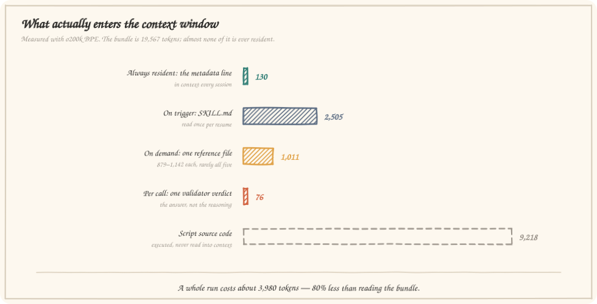
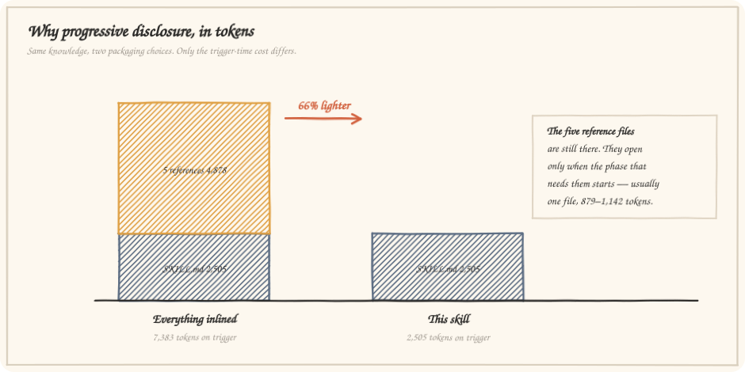
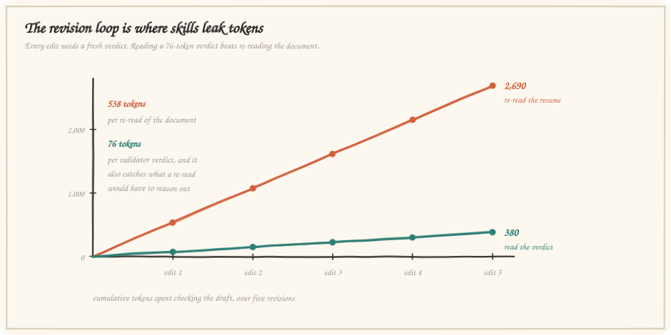

# Token Economy

What this skill costs to run, measured rather than asserted, plus what the numbers do **not** claim.

Reproduce everything on this page:

```bash
npm install        # installs the gpt-tokenizer dev dependency
npm run measure    # prints the table below
npm run diagrams   # regenerates the charts from the measurements
```

`npm run measure -- --json` writes [`token-measurements.json`](token-measurements.json), which is the single source the charts are generated from. A chart cannot drift from the numbers it claims, because it is built from the same file.

---

## Method and its limits

Counts come from **o200k BPE** via the `gpt-tokenizer` dev dependency. Claude uses a different tokenizer, so absolute counts on Claude will differ by a few percent in either direction. Every claim on this page is a **ratio between layers of the same skill measured the same way**, and those ratios are stable across BPE vocabularies.

What is measured directly: file contents, and the real stdout of the scripts on the reference resume.

What is derived by arithmetic from those measurements, and labelled as such: the inlined-variant comparison, the typical-run total, and the cumulative revision-loop lines.

What is **not** claimed anywhere: any comparison against a hypothetical agent working without the skill. That number would depend entirely on how the hypothetical was written, so it is not offered.

---

## What enters the context window

<p align="center">
  
</p>

| Layer | Tokens | Loaded |
|:--|--:|:--|
| Metadata `description` | **130** | Every session, always resident |
| `SKILL.md` | **2,505** | Once, when the skill triggers |
| One reference file | **879–1,142** | When the phase that needs it begins |
| All five references | 4,878 | Only if a run needed all of them, which is rare |
| One validator verdict | **76** | Per validation call |
| Script source | 9,218 | **Never** — executed as a subprocess |
| Whole bundle on disk | 19,567 | — |

The permanently resident cost is 130 tokens — 0.7% of the bundle. That line does one job: let the model recognise a resume request. Everything else waits until it is needed.

### Per file

| File | Tokens |
|:--|--:|
| `scripts/md-to-pdf.js` | 4,142 |
| `scripts/lint-resume.js` | 3,867 |
| `SKILL.md` | 2,505 |
| `scripts/extract-linkedin.js` | 1,209 |
| `references/ats-template.md` | 1,142 |
| `evals/evals.json` | 998 |
| `references/workflow-contract.md` | 980 |
| `references/writing-rules.md` | 967 |
| `references/intake-questions.md` | 910 |
| `references/pdf-pipeline.md` | 879 |
| `assets/resume.css` | 656 |
| `skill-card.json` | 526 |
| `manifest.yaml` | 409 |
| `assets/resume-template.md` | 377 |

Of the 19,567-token bundle, **9,218 tokens (47%) are script source that never enters the context window**, and a further 1,933 (`evals.json`, `skill-card.json`, `manifest.yaml`) are metadata read by tooling, not by the model during a run.

---

## Progressive disclosure versus one big file

<p align="center">
  
</p>

The five reference files hold 4,878 tokens of domain knowledge: the template contract, the question bank, the writing rules, the workflow contract, the PDF pipeline. Written as one long skill file, all of it would load on every trigger:

| Packaging | Trigger cost |
|:--|--:|
| Everything inlined into `SKILL.md` | 7,383 |
| This skill | **2,505** |
| | **66% lighter** |

The knowledge is not gone. It opens when its phase begins — usually one file, 879 to 1,142 tokens. A run that drafts and renders without incident touches `writing-rules.md` and nothing else.

**A typical run**: 130 resident + 2,505 on trigger + 1,142 for one reference + 203 across two script verdicts ≈ **3,980 tokens**, or **80% less than reading the bundle**.

---

## The revision loop

<p align="center">
  
</p>

Resume work is revision work. The draft is rarely the deliverable; the fourth version usually is. Every cycle needs a fresh answer to the same question — is this still valid, does it still fit, is the coverage still there.

| Per cycle | Tokens |
|:--|--:|
| Re-reading the resume document | **538** |
| Reading the validator's verdict | **76** |
| A failing verdict, with seven errors quoted | 327 |
| The same verdict as JSON | 127 |

| After | Verdicts | Re-reads |
|:--|--:|--:|
| 1 revision | 76 | 538 |
| 3 revisions | 228 | 1,614 |
| 5 revisions | **380** | **2,690** |

The verdict is also strictly more informative than a re-read: it carries the structural findings, the estimated page fill, and the keyword coverage — three things a re-read would still have to work out afterwards.

---

## Where the savings come from

**1. A narrow trigger line.** 130 tokens, specific enough to fire on "tailor my resume for this posting" and stay quiet on everything else. Trigger quality scored 92.0 in the [evaluation](EVALUATION.md).

**2. Knowledge behind doors, not in the hallway.** Five reference files, opened by phase. 66% off the trigger cost.

**3. Deterministic work in scripts.** Layout arithmetic, date-format checks, page counting, and keyword coverage are exact computations. Running them costs a subprocess and returns 76 tokens; reasoning them out in-context costs a document re-read every time and is less reliable.

**4. Compact, decision-shaped output.** The validator prints a verdict, not a transcript: pass or fail, counts, page fill, coverage, and only the codes that fired. `--json` exists for when the agent needs to branch on a specific field.

**5. One artifact, edited in place.** The resume is a file on disk that both sides edit. There is no re-pasting of the document into the conversation to keep the two copies in sync.
